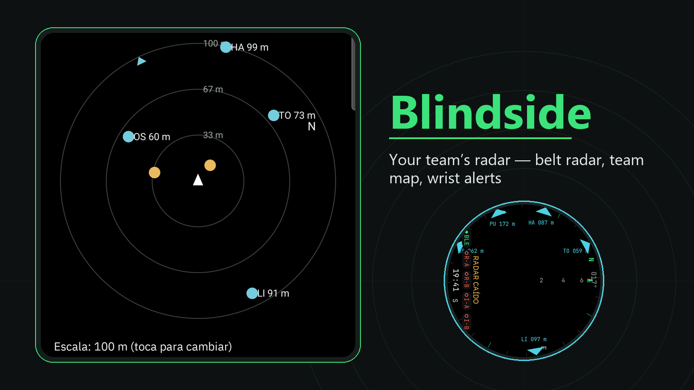
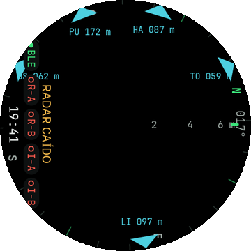
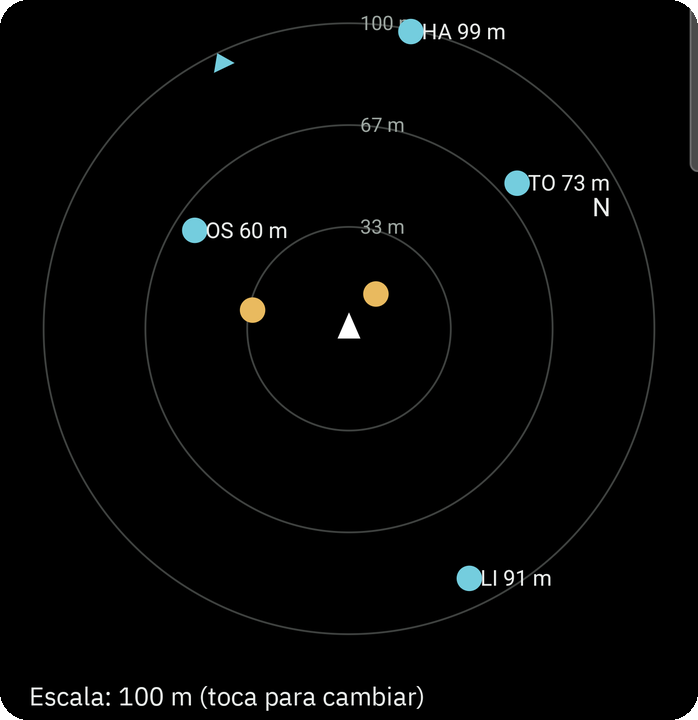
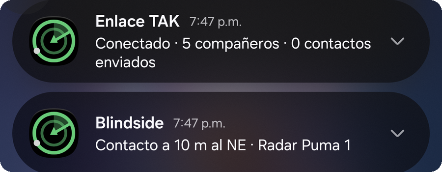
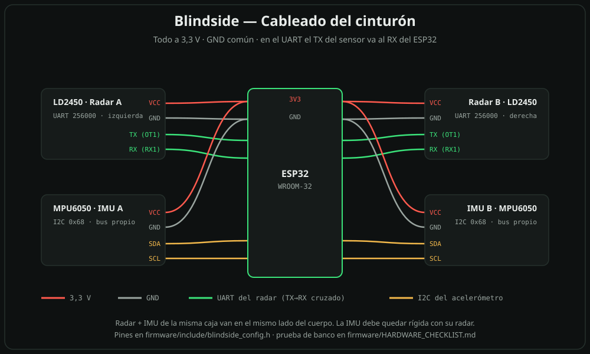

<div align="center">

# Blindside

**An open-source wrist radar for airsoft.**

Two 24 GHz radars on your belt. Contacts on your Galaxy Watch.<br>
A distinct buzz on your wrist when someone new moves into view.

**English** | [Español](README.es.md)

</div>

<div align="center">

</div>

> [!NOTE]
> **Status: built and field-ready.** The ESP32 firmware, the Wear OS watch app and an optional Android phone companion are all here and validated on real hardware. Grab the installable APKs and firmware from the [latest release](https://github.com/santiquiroz/blindside/releases/latest). First field target: a 5-hour game on 11 October 2026.

---

## Features

- **Belt radar on your wrist.** Two belt radars fused on your Galaxy Watch, with a left / center / right buzz. No phone needed — see [What it does](#what-it-does).
- **Team map with ATAK / iTAK.** Run your own OpenTAKServer ([server setup](docs/tak-server.md)). The phone app publishes each belt's contacts as yellow **unknown** points and your base, spawn and objective as map markers. Your own position comes from ATAK/iTAK, never from Blindside, so you don't appear twice. If the server or the signal drops, the belt radar and the wrist buzz keep working.
- **Allies on the watch ring.** Teammates appear as wedges on the compass ring with their distance, refreshed every 2 s.<br>
- **Team radar on the phone, no belt needed.** With the TAK link on, the **Equipo** (Team) tab turns into a circular radar — allies in cyan, team contacts in yellow, oriented with the phone compass. Tap the radar to switch 50 / 100 / 250 m.<br>
- **30 m vibration alerts.** A team contact within 30 m buzzes the phone (two pulses, even with the screen off) and leaves a notification such as "Contacto a 10 m al NE · Radar Puma 1". At most one alert per contact every 30 s.<br>
- **Optional "Publish my position".** For teammates without ATAK: the phone publishes your position every 5 s. Leave it off if you run ATAK.
- **Walking ghost filter (Doppler).** While you walk, echoes from still objects (walls, trees) are discarded using each target's Doppler speed and your own walking speed estimated from those same echoes, so real movers can be confirmed while you walk instead of only after you stop. With too few reflectors (open field) or an inconsistent estimate it switches itself off and behaves as before. Toggle "Filtro de fantasmas al caminar" in the watch Settings, on by default. Honest note: while you walk, a person standing still looks like a wall and won't show (same limit as always for a motion radar).
- **Probable ally.** A radar contact is marked probable ally — drawn in cyan with a ring, a soft short vibration, never muted, never published to the team map as unknown — when a teammate reports via the team map being within 15 m in that direction, or when a teammate's phone running Blindside is heard by the watch over Bluetooth as within ~4 m. If there are more contacts there than teammates (an opponent could be next to the ally), nothing is marked. iPhones count only through the team map.

## Quick start

Get the firmware and the APKs from the [latest release](https://github.com/santiquiroz/blindside/releases/latest).

**A. Belt owner**
1. Flash the ESP32 firmware; install the watch APK and the phone APK.
2. Pair the belt with the watch over Bluetooth LE.
3. On the phone, **Equipo** (Team) tab → **Importar paquete (.zip)** → your `jugadorN_CONFIG.zip` → set a unique callsign → **Connect**.

**B. Android teammate, no belt**
1. Install the phone APK.
2. Import your `jugadorN_CONFIG.zip` in the **Equipo** (Team) tab, set a unique callsign, connect.
3. Full steps: [docs/guia-companeros.md](docs/guia-companeros.md).

**C. iPhone teammate**
1. Install iTAK, import your `_CONFIG_iTAK.zip` package, set a unique callsign.
2. Full steps: [docs/guia-companeros.md](docs/guia-companeros.md).

Connection packages carry your private key: the server admin sends each kit privately, never in a group or a repo. To run the server: [docs/tak-server.md](docs/tak-server.md).

## What it does

- **Two HLK-LD2450 mmWave radars** ride on the front of your belt, one over each front pocket, angled outward. Together they cover **about 180° in front of you, out to about 6 m**.
- **An ESP32 in a belt pouch** adds a timestamp to the raw radar frames and to the readings of two MPU6050 motion sensors (IMUs), one inside each radar box, then streams everything over Bluetooth LE.
- **A native Wear OS app on a Samsung Galaxy Watch 7** handles all the processing:
  - combines what the two radars see;
  - follows each contact over time;
  - compensates for your own turns and steps;
  - draws the contacts on a round radar display.
- **Newly confirmed contacts buzz your wrist** with a different rhythm for left, center or right. You don't have to look. Alerts are paced: at most one buzz per second, so contacts that show up together queue and buzz one after another (center first). There's also a per-sector pause and a cap of 10 per minute, so a crowd doesn't turn into one long buzz.
- **Works without a phone**, no Wi-Fi and no cloud: the belt talks to the watch over Bluetooth LE. An optional Android companion app can pair alongside the watch for a bigger screen, recordings and a replay viewer — the watch always keeps priority.

```
[box L: LD2450 + MPU6050] ─7 wires─┐
                                   ├─ ESP32 (belt pouch, "dumb" relay) ──BLE──▶ Galaxy Watch 7
[box R: LD2450 + MPU6050] ─7 wires─┘        USB power bank                     radar-core: fusion · tracking ·
                                                                                ego-motion · wrist pose → display + haptics
```

## What's different

DIY "heartbeat sensors" built on the same radar already exist; see [Prior art](#prior-art--credits). The best-documented one mounts a radar and a small screen on the rifle, and another is a fixed Raspberry Pi display. Blindside takes a different approach:

- **Belt sensors, wrist display.** The radars follow your hips, the most stable part of your body when you move. The display is where you already glance.
- **Two radars, fused.** Wider coverage, and a center zone where a contact seen by both radars earns higher confidence.
- **Motion compensation.** A radar you wear sees "ghosts" whenever you move. The IMUs in the radar boxes track your turns and step counting estimates your walking speed, so walls and trees can be told apart from people.
- **Built around how you hold an M4:**
  - The radar angles are biased toward your support side, where the muzzle usually points.
  - The app detects when you read the watch on the inside of your support wrist ("tactical" wear, palm-up grip) and rotates the display so up means where you're aiming. Setup is a 10-second zeroing against a teammate.
  - With a vertical foregrip the watch can't be read while aiming, so vibration does the talking.
- **Stealth first.**
  - The screen stays off by default and vibration is the main channel.
  - The belt emits no light during play: the status LED stays off, and the always-on power LEDs are removed or taped over during assembly.
  - The radar module's own Bluetooth is switched off, and outside a short pairing window that you open yourself, only your paired watch can connect to the belt.
- **Record and replay.** A match can be recorded raw and replayed on a PC to tune the filters against real data.

## Honest limits

- **It does not detect heartbeats.** It detects **moving** people with a 24 GHz Doppler radar (FMCW, the same kind used in presence sensors).
- **Range is about 6 m,** with 120° per radar.
- **No reliable through-wall detection.** Don't count on it to see through walls or cover. The signal does pass through a thin, dry plastic cover with no metal in it; that is how the enclosure works. We have not yet tested foliage, fabric (wet or dry) or rain. Wet or metal-coated materials in front of the radar are expected to degrade it.
- **People standing perfectly still fade out.** The app holds their last position for a few seconds.
- **Friend or foe is only a conservative *probable* ally hint.** A contact is marked probable ally when a teammate reports via the team map being within 15 m in that direction or is heard by the watch over Bluetooth as within ~4 m — drawn in cyan with a ring, never muted, never published to the team map as unknown. GPS (±5–15 m) and Bluetooth distance are approximate, so ambiguous cases are not marked: if there are more contacts there than teammates, nothing is marked. Per-player identification is still on the roadmap.
- **Ghosts are reduced while walking, not eliminated.** The Doppler ghost filter discards echoes from still objects while you walk so real movers can be confirmed without stopping, but clutter can still slip through. In open field with few reflectors it switches itself off and falls back to the old behaviour (confirm after you stop). Only confirmed contacts reach the team map.
- **Team contacts are ±5–10 m.** They are placed from the phone's GPS plus the direction you face.
- **No contacts published without GPS and heading.** Without a fresh phone GPS fix or a reliable facing direction the belt publishes nothing; tactical points still go.
- **iPhones need iTAK.** There is no Blindside app for iOS; iPhone teammates join the team map with iTAK.

## Hardware (v1)

| Part | Rough price (USD, varies by store) | Notes |
|---|---|---|
| ESP32-WROOM-32 DevKit (30-pin) | ~US$5–10 | NimBLE peripheral, 2 UARTs + 2 I2C buses |
| 2× HLK-LD2450 | ~US$6–15 each | 24 GHz, up to 3 targets, ±60°, ~6 m. The Ai-Thinker RD-03D uses the same frame format (untested). |
| 2× MPU6050 (GY-521) | ~US$1–3 each | One inside each radar box, rigid with its radar; no magnetometer needed |
| JST ZH 1.5 mm 4-pin cables | ~US$5–10 per kit | The LD2450 connector is not 2.54 mm |
| ESP32 screw-terminal board | ~US$5–10 | No soldering, and no Dupont connectors to wiggle loose |
| Two 7-wire cables, 50–80 cm | — | Pouch to radar boxes. One old Ethernet cable (8 wires) per box works, or two old USB cables (4 wires each) per box. |
| USB power bank | — | The belt draws about 300 mA at 5 V, so 10,000 mAh lasts well over 15 h |
| Samsung Galaxy Watch 7 | — | Wear OS 6 (API 36); other Wear OS watches untested |
| 3D-printed radar boxes | — | Hold the angles, stop BBs, and pass the 24 GHz signal through a solid-infill window (no metal in front of the radar). Aluminum foil or a piece of tin can between each radar and your body, insulated from the electronics, cuts down the radar's rear lobe, which would otherwise pick up your own movement. |

## Wiring



**Radars on 5 V, IMUs on 3.3 V.** Power each LD2450 from the ESP32's **VIN** pin (the USB 5 V), each IMU from the **3V3** pin, and share a common **GND**. The LD2450's UART is 3.3 V logic, so TX/RX go straight to the ESP32 (sensor TX → ESP32 RX and vice versa). All pins live in [firmware/include/blindside_config.h](firmware/include/blindside_config.h).

**Radars — 2× HLK-LD2450 (UART 256000 baud, 5 V supply, 3.3 V logic):**

| LD2450 pin | Radar A → ESP32 | Radar B → ESP32 |
|---|---|---|
| 5V | VIN | VIN |
| GND | GND | GND |
| TX (OT1) → ESP32 RX | GPIO16 (silkscreen `RX2`) | GPIO26 |
| RX (RX1) ← ESP32 TX | GPIO17 (silkscreen `TX2`) | GPIO27 |

Radar B rides the GPIO matrix because UART1's default pins (9/10) belong to the SPI flash.

**IMUs — 2× MPU6050 / GY-521 (I2C, 100 kHz, address 0x68):** each IMU has its own I2C bus, so both keep the default address — no AD0 jumper, no conflict.

| GY-521 pin | IMU A → ESP32 | IMU B → ESP32 |
|---|---|---|
| VCC | 3V3 | 3V3 |
| GND | GND | GND |
| SDA | GPIO32 | GPIO21 |
| SCL | GPIO33 | GPIO22 |

- **Radar A + IMU A go in the left hip box, Radar B + IMU B in the right box.** Each IMU must be rigid with its own radar — the watch uses it to cancel your turns and steps.
- **One VIN and one 3V3 pin feed both boxes:** both boxes' 5V wires go into the VIN screw terminal, both 3V3 wires into the 3V3 terminal, and the GND wires into the GND terminals. Inside each box the GND wire splits to the radar and the IMU. Total draw is about 300 mA at 5 V, straight from the power bank.
- **Use the radar's JST socket** (JST ZH 1.5 mm, labelled `GND TX RX 5V`), not its 2.54 mm pin header: that header is for USB firmware updates, and Dupont jumpers there shake loose. Its `3.3V` pin is the output of the radar's own regulator, not a power input — feeding the radars from the ESP32's 3V3 would put their transmit bursts on the ESP32's regulator and can brown it out.
- **Map each wire by the label printed on the board, not by the cable colour** — on these JST kits red is not necessarily 5V. Swapping 5V and GND can kill a radar; check with a multimeter before plugging it in. Which conductor of the long cable carries what (twisted pairs) is in the spec, §2.2.
- If you have one, a 100–470 µF capacitor across 5V and GND at each radar smooths its transmit bursts.
- On first boot the firmware takes each LD2450 off Bluetooth and sets it to 256000 baud. Confirm over USB serial that the `diag` line shows `radar 0: baud=256000` and `radar 1: baud=256000`, and that the IMUs read `imu0[ok=1 who=0x68 …]` (a clone reporting 0x70/0x71/0x98 is also fine). The full bench checklist is in [firmware/HARDWARE_CHECKLIST.md](firmware/HARDWARE_CHECKLIST.md).

## How it works (short version)

1. **The belt stays simple.** The ESP32 never interprets targets. Every 100 ms it bundles the raw LD2450 frames and the 50 Hz readings of both IMUs, each with its own timestamp, into one BLE notification, or several consecutive ones when the bundle doesn't fit.
2. **The watch does the thinking.** The processing lives in `radar-core`, a pure Kotlin module you can unit-test on a PC. For each bundle it:
   - decodes the radar frames (their unusual sign-bit format is handled explicitly);
   - drops readings from your own arms and rifle;
   - converts everything to hip coordinates, then compensates for your turns (IMU) and your steps;
   - keeps each contact as a track with a Kalman filter;
   - confirms a new track only after it shows up in 3 of 5 windows;
   - applies the ghost rules;
   - picks the frame the display uses from your wrist pose;
   - in Vista mode (screen always on), redraws the radar at 30 fps, predicting each track forward between bundles.
3. **Everything is replayable.** A recording file (`.bsrec`) stores the raw BLE data plus the watch's own sensors, so any field session can be replayed exactly to test changes.

The full design (in Spanish) is in [docs/superpowers/specs/2026-09-30-blindside-v1-design.md](docs/superpowers/specs/2026-09-30-blindside-v1-design.md).

## Roadmap

- **v1:**
  - belt node and watch app;
  - fused 180° radar with motion compensation;
  - haptic direction cues;
  - stealth mode and an "eliminated" mode;
  - calibration wizards;
  - match recording.
- **v1.5:**
  - vibration motors in the radar boxes, so the belt itself tells direction by location (needs a purchase);
  - auto-silence when you're aiming;
  - tap a contact to mark it as a friend;
  - a kneeling profile;
  - a quick shoulder switch mid-game;
  - a replay viewer and heatmap;
  - a sentry node that guards a doorway and alerts your wrist;
  - a classic "COD" mode with a snapshot every 4 seconds;
  - a tournament mode;
  - maybe a thermal sensor, if the recordings show it's needed.
- **v2:**
  - UWB friend-or-foe;
  - squad link over ESP-NOW;
  - 360° coverage;
  - a rifle-rail node;
  - a phone app and ATAK/CoT export;
  - spatial audio through an earpiece.
- **Long term, beyond airsoft:**
  - with the same hardware:
    - sentry/tripwire mode;
    - match statistics;
    - reaction drills;
    - "someone behind me" while walking;
    - gait analysis with the two hip IMUs;
    - Home Assistant presence;
    - accessibility aid (complements a cane);
  - with new parts:
    - a rear radar for motorcycles in RevScope;
    - a 60 GHz vital-signs sensor.
- **"Halo mode" (long term):** a 360° motion tracker with friendlies in another colour, at 15-25 m. It needs RFbeam K-LD7, V-LD3 or K-MD7, or TI IWRL6432 radars. All of them are ≤ 20 dBm and safe when pointed away from the body. See [the long-range radar report](docs/research/reports/Radares%20de%20largo%20alcance%20y%20salud.md) (Spanish).

## Repository layout

```
docs/
  superpowers/specs/     v1 design specification (Spanish)
  research/reports/      research report (Spanish)
  research/research_notes/  sourced notes: LD2450, biomechanics, Wear OS/BLE,
                            tracking algorithms, prior art & rules, UX ideas
  img/                   README showcase images (built by docs/img/make_showcase.py from docs/img/raw/)
firmware/                (coming) PlatformIO + NimBLE-Arduino
watch/                   (coming) radar-core (pure Kotlin) + wear-app (Wear OS)
tak/                     server scripts (ots-player.sh, windows-network.ps1, wsl-keepalive.vbs) + tak-probe.py
```

## Fair play, legal and safety

- **Airsoft fields:** none of the rulebooks we found mention radar, but many fields ban thermal optics as a "wallhack", and the same argument applies here.
  - Ask your field before playing, declare the device at check-in, and make sure the other players know. Never use it to detect or follow people outside a game.
  - Blindside will ship an **"eliminated" mode** that turns off the radar alerts and the display until you respawn. A tournament mode is planned for v1.5.
- **Radio:** check your local rules before using a 24 GHz radar.
  - US: FCC §15.249.
  - EU: CEPT ERC 70-03 lists 24.05–24.25 GHz for radiodetermination and 24.00–24.25 GHz for non-specific short-range devices (100 mW e.i.r.p.; primary text not verified).
  - Colombia: ANE Resolution 105/2020 covers 24.05–24.25 GHz.
  - The LD2450 datasheet states a 24.00–24.25 GHz sweep, so in Colombia the lowest 50 MHz (24.00–24.05 GHz) sits in a grey zone (a 2024 addition, Res. ANE 153/2024, may cover it; unverified).
  - Don't modify the LD2450's firmware, antenna or power.
  - Publishing the code is fine; selling assembled kits may require homologation, CE marking or FCC certification.
- **Security:** the LD2450 ships with its own Bluetooth on, so anyone nearby could reconfigure it; Blindside's firmware turns it off. The belt accepts a single connection. It takes a new pairing only during a 60-second window, which opens when no watch is paired yet or when you hold the ESP32's BOOT button for 3 s within the first minute after it starts up (holding it while powering on enters flash mode instead). Pairing uses a random 6-digit key unique to each belt. Outside that window only the paired watch can connect. Inside it, another device can connect but can't read anything without the key, so pair away from other players. Holding BOOT for 10 s or more (also within the first minute) clears the pairing; after that, forget the belt in the watch's Bluetooth settings and pair again.
- **Not a safety device.** Don't rely on it to protect anyone.
- **Not affiliated** with Activision (Call of Duty), 20th Century Studios (Aliens) or Hi-Link.

## Prior art & credits

Blindside stands on the shoulders of these projects. Two have no license, and Rob Smith's code uses a non-commercial license that is not open source and is incompatible with the AGPL, so ideas are credited here and no code is copied:

- **ScienceShack: [Heartbeat Sensor from Modern Warfare 2](https://hackaday.io/project/205879-heartbeat-sensor-from-modern-warfare-2)** ([code](https://github.com/jrtage/MW2-Heartbeat-Sensor)). LD2450, XIAO RP2350 and an OLED on an M-LOK rail mount. Their note on the module's X-axis orientation saved us a headache.
- **[Bronsonalan/mw2-heartbeat-sensor](https://github.com/Bronsonalan/mw2-heartbeat-sensor).** Raspberry Pi and LD2450, with a phosphor-style display and a tracking layer.
- **Rob Smith: [a real working Aliens M314 motion tracker](https://hackaday.io/project/203817-a-real-working-alien-motion-tracker)** ([code](https://github.com/RobSmithDev/alienmotiontracker)). 60 GHz radar on a Raspberry Pi.

Technical references:
- Hi-Link's [Serial Communication Protocol V1.03](https://make.net.za/wp-content/datasheets/HLK%20LD2450%20Serial%20Communication%20Protocol%20v1.03.pdf), [Instruction Manual V1.00](https://www.tinytronics.nl/product_files/006000_HLK-LD2450-Instruction-Manual.pdf) and [User Guide](https://d.hlktech.net/download/HLK-LD2450/1/HLK-LD2450%20operation%20manual.doc..pdf). The User Guide mislabels its sign and Bluetooth on/off examples; the decoder follows the protocol document.
- The [ESPHome LD2450 component](https://esphome.io/components/sensor/ld2450/), used as a cross-check. It is GPLv3, and Blindside's decoder is written from the Hi-Link protocol document.
- x-io Technologies' [Fusion](https://github.com/xioTechnologies/Fusion), for its IMU rest-detection defaults.
- TI's [mmWave group tracker tuning guide](https://e2e.ti.com/cfs-file/__key/communityserver-discussions-components-files/1023/3D_5F00_people_5F00_counting_5F00_tracker_5F00_layer_5F00_tuning_5F00_guide-_2800_1_2900_.pdf), for tracking ideas.

The full sourced bibliography is in [docs/research/](docs/research/).

## Contributing

Ideas and issues are welcome, especially:
- enclosure and mounting designs;
- tests with other Wear OS watches or the RD-03D;
- field reports and raw `.bsrec` recordings, once the app exists.

## License

[GNU AGPL-3.0](LICENSE). If you ship a modified version, share the source.
